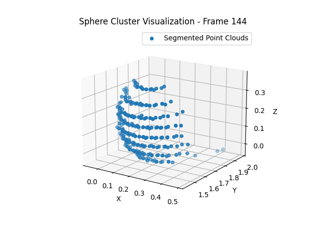
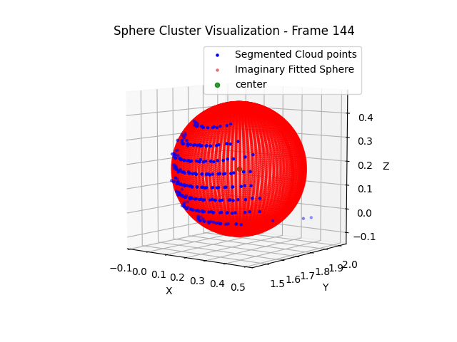
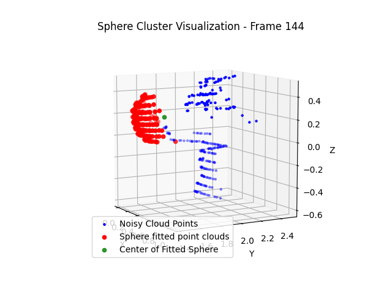
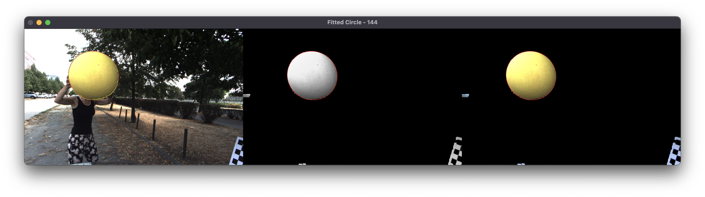
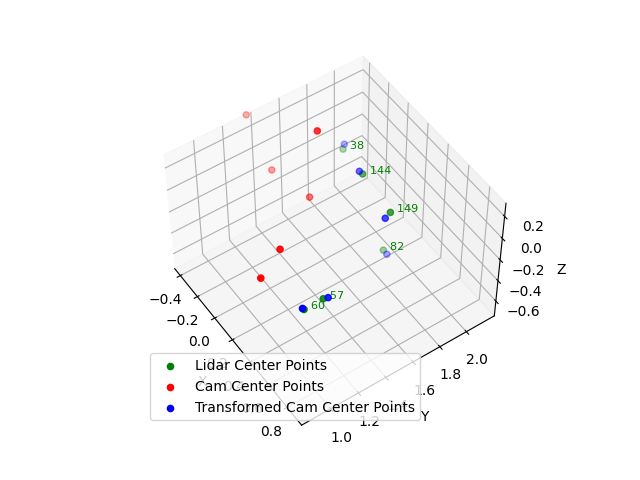

## Camera and Lidar Calibration of Extrinsic Parameters Using a Sphere


The following paper was implemented from the scratch.

```
@INPROCEEDINGS{9197316,
  author={Tóth, Tekla and Pusztai, Zoltán and Hajder, Levente},
  booktitle={2020 IEEE International Conference on Robotics and Automation (ICRA)}, 
  title={Automatic LiDAR-Camera Calibration of Extrinsic Parameters Using a Spherical Target}, 
  year={2020},
  volume={},
  number={},
  pages={8580-8586},
  keywords={Cameras;Calibration;Laser radar;Three-dimensional displays;Estimation;Mathematical model;Robustness},
  doi={10.1109/ICRA40945.2020.9197316}}
```
## How does it work

The calibration process leverages the static intrinsic parameters of the camera (focal length, principal point) and the known size of the spherical object to accurately calibrate the camera and LiDAR systems. 


```
The cameras are the same, their intrinsic matrix is as follows: 

K=[1250 0 960; 0 1250 600; 0 0 1] 

Sphere radius is 30cm, LiDAR points are given in meters.
```

The calibration process involves several steps to accurately determine the relative rotation and translation between a camera and a Lidar device by tracking a spherical object in motion. Here's an overview of the workflow:

1. **LiDAR Sphere Fitting**: For each frame of the recorded LiDAR data, a robust sphere fitting algorithm is applied to the point cloud to locate the spherical object. This involves identifying points that belong to the sphere and fitting a mathematical model to these points to determine the center and radius of the sphere. The fitted sphere points are then visualized in red and saved in PLY format for further analysis.

`
In the third image below, we can see the lady holding the sphere and only the sphere is being segmented as expected.`

<p align="center">
  
  
  
</p>

2. **Camera Edge Detection and Ellipse Fitting**: Concurrently, the camera images are processed to detect the edges of the spherical object using edge detection algorithms. From these edges, an ellipse fitting method is applied to approximate the shape and location of the sphere within the image. This step is crucial for identifying the sphere's projection in the camera's view.

<p align="center">
  
  
</p>

3. **Determining the 3D Sphere Center**: Utilizing the camera's intrinsic parameters and the results from the ellipse fitting, the 3D center of the sphere is computed relative to the camera's coordinate system. This computation involves converting the 2D ellipse location in the image to a 3D point in space, taking into account the known radius of the sphere and the camera's intrinsic matrix.

4. **Calibration via Point Registration**: After processing all frames, a selection of frames where both the LiDAR and camera-based sphere detection are deemed accurate is made. For these selected frames, a point registration algorithm is used to estimate the relative rotation and translation between the camera and the LiDAR system. This step is critical for aligning the coordinate systems of the camera and LiDAR, allowing for a unified spatial understanding of the scene.

<p align="center">
  
</p>

