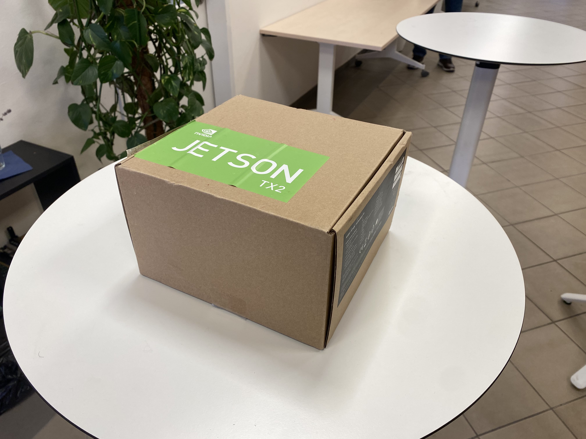
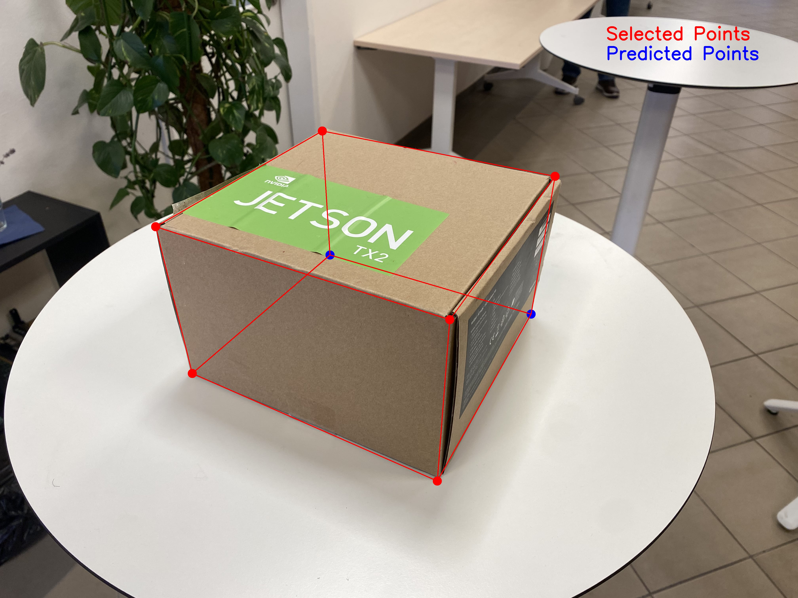

# 3D Box Position Estimation Using EPnP

This project is an application of the EPnP algorithm and it demonstrates the process of estimating the 3D position of a rectangular box in space using a camera. It leverages the `Efficient Perspective-n-Point (EPnP) algorithm` for 3D object position estimation relative to a camera. This project involves taking images of a chessboard pattern for camera calibration, creating a 3D model of a box, selecting points on an image, and then using these points to estimate the position of the box.

<p align="center">
  
  
</p>

## Installation

This project requires Python 3.x and the following Python packages:

- Numpy
- Matplotlib
- OpenCV-Python

You can install these packages using pip:

```bash
pip install numpy matplotlib opencv-contrib-python
```

## Instructions

1. Capture images of a chessboard pattern with your camera for calibration.
2. Run the `calibrate.py` script to calibrate the camera and to obtain its intrinsic parameters.
3. Measure the dimensions of a rectangular box (like a computer case) you wish to estimate the position of.
4. Take a picture of the box for input.
5. Run the `EPnP.py` script and manually select 6 corners of the box in the mentioned order.
6. The script will use these points to run the EPnP algorithm and estimate the box's position.
7. Extrinsic parameters obtained from the EPnP algorithm will be written to a text file.
