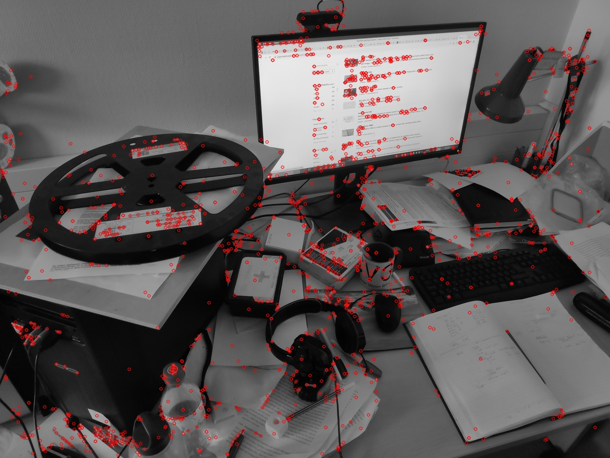
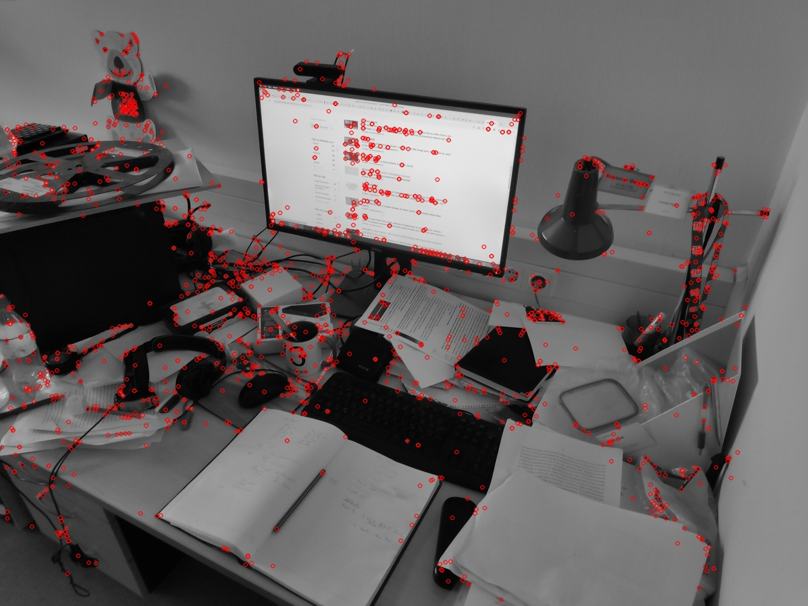
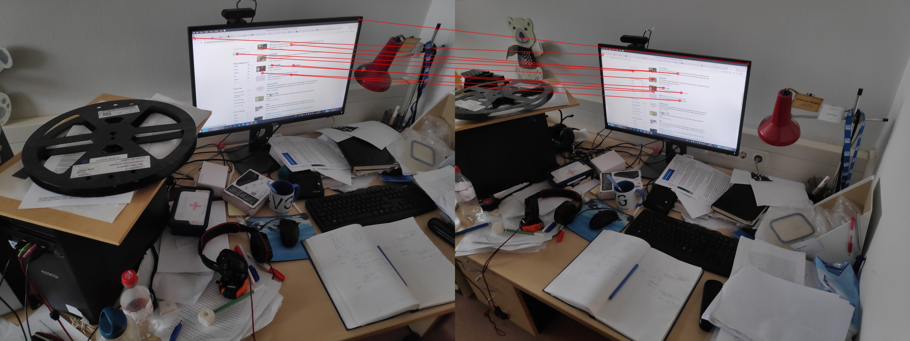
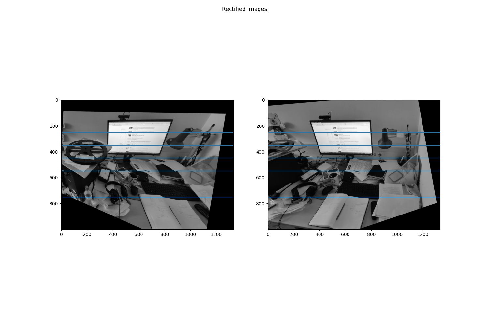

# Stereo Rectification

This project provides a Python implementation for stereo rectification of a pair of images. This method is crucial in computer vision tasks to align two stereo images along the same epipolar lines, which is particularly useful in 3D reconstruction and depth estimation tasks.

## Requirements

Ensure you have Python 3.x installed on your system. This project requires OpenCV (cv2) and Matplotlib, which can be installed via pip:

```bash
pip install numpy opencv-contrib-python matplotlib
```
Execute `main.py` for stereo rectification. It is just the fusion of the functions from `preprocess.py` and `rectification.py` scripts. So nevermind about the other scripts.

## How does it work

The following are the input images.
<p align="center">
  
  
</p>

**Step 1: Feature Detection:** Utilizes the `Scale-Invariant Feature Transform (SIFT) algorithm` to detect unique keypoints in each image. This step is fundamental in identifying points of interest across the two images that can be used for matching.

<p align="center">
  
  
</p>

**Step 2: Feature Matching:** Employs the `Fast Library for Approximate Nearest Neighbors (FLANN)` matcher to efficiently find matches between the keypoints detected in the two images. This matching process is vital for establishing correspondence between points across the stereo pair.

<p align="center">
  
</p>

**Step 3: Fundamental Matrix Computation:** With the matched keypoints, the script calculates the fundamental matrix. The fundamental matrix represents the epipolar geometry between the two images, encapsulating the intrinsic projective geometry between the pairs, which is crucial for the rectification process.

**Step 4: Stereo Rectification:** Leveraging the fundamental matrix, the script performs stereo rectification on the image pair. This step transforms the images to ensure that corresponding points in the images are aligned on the same horizontal line (epipolar lines), thereby simplifying the process of finding corresponding points between the two images in stereo vision applications.

<p align="center">
  
</p>

Parallel lines were drawn across both warped images to demonstrate that stereo rectification was successful, as these lines intersected identical locations in both the images.
